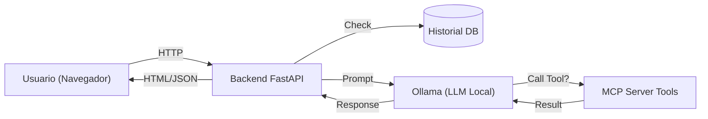

# 🧠 MCP Ollama Local

> **Web Local (FastAPI) + IA Local (Ollama) + Herramientas MCP**


---

**mcp-ollama-local** es una plataforma ligera diseñada para ejecutar un entorno de chat con IA completamente local, integrando la potencia de **Ollama** con la flexibilidad del **Model Context Protocol (MCP)**.  

Permite conversar con LLMs locales (como `qwen`, `llama3`, etc.) y otorgarles capacidades reales mediante herramientas seguras (acceso a archivos, búsqueda, información del sistema), todo con persistencia en SQLite.

---

## 🚀 Características Principales

- **Chat Conversacional**: Interfaz web limpia para interactuar con tus modelos locales.
- **Protocolo MCP**: Integración nativa para expandir las capacidades del modelo (extensible).
- **Herramientas Seguras**: Incluye herramientas de sistema (`system_info`, `list_files`, `grep_text`).
- **Historial Persistente**: Guardado de conversaciones en SQLite.
- **Privacidad Total**: Todo corre en tu máquina (`localhost`), ideal para datos sensibles.

## 🛠 Arquitectura

El flujo de información es directo y local:



## 📋 Requisitos Previos

1.  **Ollama**: Instalado y ejecutándose (`ollama serve`).
2.  **UV**: Gestor de paquetes de Python (recomendado) o Python 3.13+.
3.  **Modelo**: Al menos un modelo descargado (ej. `ollama pull qwen2.5-coder`).

## ⚡️ Inicio Rápido

Este proyecto incluye un `Makefile` para facilitar todas las tareas.

1.  **Clonar y configurar entorno**:
    ```bash
    git clone https://github.com/vladimiracunadev-create/mcp-ollama-local.git
    cd mcp-ollama-local
    make install
    ```

2.  **Asegurar que Ollama corre**:
    ```bash
    ollama serve
    # En otra terminal, descarga un modelo si no tienes uno
    ollama pull qwen2.5-coder:7b
    ```

3.  **Ejecutar la aplicación**:
    ```bash
    make run
    # O alternativamente: python main.py
    ```

4.  **Abrir en navegador**:
    Visita [http://localhost:8000](http://localhost:8000)

## 🧰 Comandos Disponibles

Usa `make help` para ver la lista completa. Los más comunes son:

| Comando | Descripción |
| :--- | :--- |
| `make install` | Instala dependencias y configura el entorno virtual. |
| `make run` | Levanta el servidor de desarrollo en puerto 8000. |
| `make lint` | Verifica estilo y errores con **Ruff**. |
| `make format` | Corrige formato de código automáticamente. |
| `make test` | Ejecuta las pruebas unitarias con **Pytest**. |
| `make clean` | Elimina archivos temporales y cachés. |

## 📂 Estructura del Proyecto

```text
mcp-ollama-local/
├── apps/
│   └── web/            # Aplicación FastAPI y frontend
│       ├── templates/  # Plantillas HTML (Jinja2)
│       └── static/     # Assets estáticos (CSS, JS)
├── mcp_server/         # Implementación del servidor MCP y herramientas
├── host/               # Lógica de interacción con entorno host
├── data/               # Base de datos SQLite y logs
├── main.py             # Punto de entrada alternativo
├── Makefile            # Comandos de automatización
└── pyproject.toml      # Configuración de dependencias y herramientas
```

## 🤝 Contribuyendo

1.  Haz un Fork del repositorio.
2.  Crea una rama para tu feature (`git checkout -b feature/nueva-magia`).
3.  Asegúrate de que el código pase el linter (`make lint`).
4.  Haz Commit y Push.
5.  Abre un Pull Request.

Ver [CONTRIBUTING.md](CONTRIBUTING.md) para más detalles.

## 📄 Licencia

Este proyecto está bajo la Licencia MIT. Consulta el archivo [LICENSE](LICENSE) para más información.
