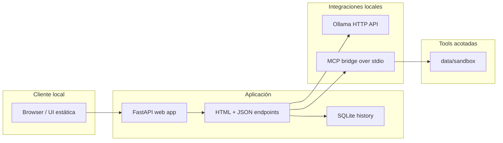
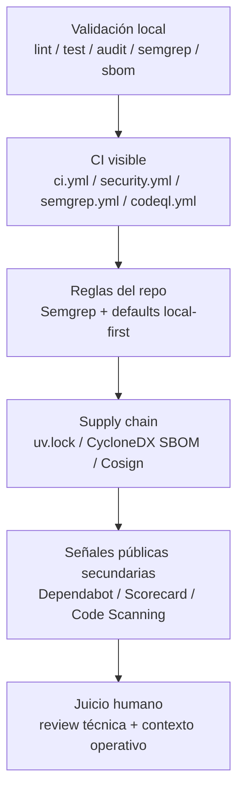

# 🧠 MCP Ollama Local

> **Web local (FastAPI) + IA local (Ollama) + herramientas MCP**


Interfaz web local para conversar con modelos servidos por Ollama, con un puente MCP acotado a un sandbox local y persistencia simple en SQLite.

El objetivo del proyecto es ser útil y mantenible en entorno local. No intenta ser una plataforma multiusuario, ni un gateway público, ni una suite de seguridad “enterprise”.

> [!NOTE]
> La confianza del proyecto se apoya en validaciones reproducibles, revisión técnica y documentación consistente. Los badges de cabecera son informativos, no la evidencia principal de calidad.

## 🚀 Overview

- Backend FastAPI que expone páginas HTML y endpoints JSON.
- Cliente HTTP hacia Ollama para `/api/chat`.
- Servidor MCP por `stdio` con herramientas locales limitadas a `data/sandbox`.
- Historial persistente en `data/chat_history.sqlite`.
- Despliegue soportado en local, Docker y Kubernetes básicos.

## 🏗️ Arquitectura


```mermaid
flowchart LR
    subgraph Client["Cliente local"]
        Browser["Browser / UI estática"]
    end

    subgraph App["Aplicación"]
        Web["FastAPI web app"]
        API["HTML + JSON endpoints"]
        DB["SQLite history"]
    end

    subgraph AI["Integraciones locales"]
        Ollama["Ollama HTTP API"]
        MCP["MCP bridge over stdio"]
    end

    subgraph Tools["Tools acotadas"]
        Sandbox["data/sandbox"]
    end

    Browser --> Web
    Web --> API
    API --> DB
    API --> Ollama
    API --> MCP
    MCP --> Sandbox
```

Flujo normal:

1. El navegador llama al backend en `http://127.0.0.1:8000`.
2. El backend valida la request, consulta Ollama y, si el modelo pide herramientas, abre una sesión MCP local.
3. Las tools MCP solo leen dentro de `data/sandbox`.
4. La conversación se guarda en SQLite cuando el chat usa historial.

## 🧰 Stack real

- Python 3.13
- FastAPI + Uvicorn
- `httpx` para integración con Ollama
- `mcp` para el bridge de tools
- SQLite para persistencia local
- Ruff, Pytest y Bandit para validación

No hay Node, npm ni build frontend porque la UI es HTML/CSS/JS estático y hoy no lo necesita.

## 🛡️ Seguridad real

Controles implementados hoy:

- Bind local por defecto en desarrollo (`127.0.0.1:8000`).
- CORS configurable por `ALLOWED_ORIGINS`.
- API key opcional; si `REQUIRE_API_KEY=true`, los endpoints sensibles exigen `X-API-Key`.
- Rate limiting simple en memoria por IP.
- Cabeceras de seguridad web razonables para una app local.
- Sandbox MCP limitado a `data/sandbox`.
- Contenedor no-root en Docker.
- Validación reproducible con Ruff, Pytest, Bandit y `pip check`.
- Auditoría de CVEs con `pip-audit` en workflow de seguridad.
- Code scanning con CodeQL y reglas Semgrep específicas del repo.
- SBOM CycloneDX y firma de artefactos de release cuando aplica.

Límites importantes:

- El rate limit es en memoria y no sirve como control distribuido.
- No hay gestión de usuarios, sesiones ni RBAC.
- No se aíslan prompts ni respuestas del modelo frente a uso malicioso del operador local.
- El sandbox protege el acceso de las tools MCP, no el sistema operativo completo.
- HSTS solo aplica si sirves la app detrás de HTTPS real.
- `pip-audit` necesita salida de red al servicio de advisories.

## 🧭 Security & Trust Profile

La estrategia del repositorio no depende de una sola herramienta ni de una sola puntuación. Se construye por capas:

1. validación reproducible local
2. controles visibles en CI
3. reglas adaptadas al contexto del repo
4. evidencia de supply chain
5. señales públicas complementarias

Controles principales:

- `ci.yml`: contrato base de calidad
- `security.yml`: Bandit + `pip-audit`
- `codeql.yml`: code scanning semántico
- `semgrep.yml`: reglas locales del repositorio
- `supply-chain.yml`: SBOM y firma en release
- `scorecard.yml`: señal pública complementaria
- `dependabot.yml`: alertas y PRs de actualización para dependencias y workflows

El detalle completo vive en [docs/security-trust-profile.md](docs/security-trust-profile.md).


```mermaid
flowchart TD
    Local["Validación local\nlint / test / audit / semgrep / sbom"] --> CI["CI visible\nci.yml / security.yml / semgrep.yml / codeql.yml"]
    CI --> Rules["Reglas del repo\nSemgrep + defaults local-first"]
    Rules --> Supply["Supply chain\nuv.lock / CycloneDX SBOM / Cosign"]
    Supply --> Public["Señales públicas secundarias\nDependabot / Scorecard / Code Scanning"]
    Public --> Review["Juicio humano\nreview técnica + contexto operativo"]
```

## ⚡ Instalación rápida

### Local

```bash
uv sync --frozen
make run
```

Abre [http://127.0.0.1:8000](http://127.0.0.1:8000).

Requisitos:

- Ollama corriendo en `http://localhost:11434`
- Un modelo disponible, por ejemplo:

```bash
ollama pull qwen3:8b
```

### Docker

```bash
docker compose up --build
```

El compose publica solo en `127.0.0.1:8000`.

## ⚙️ Configuración

Variables soportadas:

| Variable | Default | Uso |
| --- | --- | --- |
| `OLLAMA_URL` | `http://localhost:11434` | URL base del servidor Ollama |
| `MODEL` | `qwen3:8b` | Modelo usado por `/api/chat` |
| `DATA_DIR` | `./data` | Ruta para SQLite y sandbox |
| `API_KEY` | no definida | Clave opcional para proteger la API |
| `REQUIRE_API_KEY` | `false` | Si es `true`, exige `X-API-Key` |
| `ALLOWED_ORIGINS` | `http://localhost:8000,http://127.0.0.1:8000` | Lista CORS separada por comas |

Ejemplo:

```bash
cat > .env <<'EOF'
MODEL=qwen3:8b
OLLAMA_URL=http://localhost:11434
API_KEY=change-me
REQUIRE_API_KEY=true
ALLOWED_ORIGINS=http://127.0.0.1:8000
EOF
```

## ✅ Validación

Comandos soportados:

```bash
make lint
make format
make format-check
make test
make smoke
make audit
make semgrep
make sbom
make trust-check
make ci-local
```

Qué hace cada uno:

- `make lint`: `ruff check .`
- `make format`: `ruff format .`
- `make format-check`: verifica formato sin modificar archivos
- `make test`: suite completa de pytest
- `make smoke`: subset rápido de API/backend
- `make audit`: `bandit` + `pip check`
- `make semgrep`: reglas Semgrep propias del repositorio
- `make sbom`: genera un SBOM CycloneDX desde la `.venv`
- `make trust-check`: `ci-local` + Semgrep + SBOM
- `make ci-local`: replica el contrato principal de CI

En GitHub Actions:

- `ci.yml` ejecuta `make ci-local`
- `security.yml` ejecuta `bandit` y `pip-audit`
- `codeql.yml` publica code scanning en GitHub
- `semgrep.yml` ejecuta reglas locales y sube SARIF
- `supply-chain.yml` genera SBOM y firma artefactos de release
- `scorecard.yml` añade una señal pública complementaria sobre higiene del repo

## 🔎 Verificación externa opcional

Además de las validaciones propias del repositorio, se puede ejecutar SafeSkill como revisión externa complementaria desde terminal, sin incorporarlo como dependencia estructural del proyecto:

```bash
npx skillsafe scan .
npx skillsafe scan . --json > safeskill-report.json
```

Uso recomendado:

- como señal adicional durante revisión manual o mantenimiento,
- para inspeccionar comportamiento de red, acceso a archivos, prompt injection y coherencia entre contenido y código,
- y para comparar findings externos con los controles reales del repositorio.

Límites importantes:

- SafeSkill no reemplaza tests, revisión técnica, validación local ni CI del proyecto.
- Un score o badge externo no constituye una certificación del producto.
- Cualquier finding debe interpretarse con contexto; los falsos positivos existen y los riesgos reales no deben descartarse solo porque un scan “salga bien”.

Más detalle en [docs/security-verification.md](docs/security-verification.md).

## 🌐 Señales públicas complementarias

Terceros pueden observar varias señales, pero ninguna se trata como verdad absoluta por sí sola:

- CodeQL en code scanning de GitHub
- Dependabot para dependencias y workflows
- OpenSSF Scorecard como señal pública secundaria
- SBOM de release y firma Cosign cuando aplica

La intención es mostrar evidencia acumulativa de mantenimiento y criterio técnico, no optimizar un único badge o score.

## 💬 Uso

- `/` muestra estado básico de web, Ollama y MCP
- `/chat` envía prompts al modelo
- `/options` ejecuta tools MCP directamente
- `/history` consulta el historial guardado en SQLite

Ejemplos:

```bash
curl -sS http://127.0.0.1:8000/api/health
curl -sS -X POST http://127.0.0.1:8000/api/mcp -H 'Content-Type: application/json' -d '{"tool":"system_info","args":{}}'
curl -sS -X POST http://127.0.0.1:8000/api/chat -H 'Content-Type: application/json' -d '{"message":"hola"}'
```

Con API key obligatoria:

```bash
curl -sS http://127.0.0.1:8000/api/health -H 'X-API-Key: change-me'
```

## 🔧 Troubleshooting

- Si `/api/health` muestra `ollama_ok=false`, verifica `OLLAMA_URL` y `ollama serve`.
- Si Docker no alcanza Ollama en Linux, revisa `host.docker.internal` y el bind del host.
- Si `make audit` falla solo en `pip-audit`, revisa el workflow de seguridad o ejecuta el audit con salida de red.
- Si habilitas `REQUIRE_API_KEY=true` sin `API_KEY`, la app no arrancará.

Guías relacionadas:

- [INSTALL.md](INSTALL.md)
- [SECURITY.md](SECURITY.md)
- [CONTRIBUTING.md](CONTRIBUTING.md)
- [TROUBLESHOOTING.md](TROUBLESHOOTING.md)
- [docs/security-trust-profile.md](docs/security-trust-profile.md)
- [docs/aws-migration.md](docs/aws-migration.md) — guía completa de migración a AWS (arquitectura, paso a paso, costos, seguridad)

## ☁️ Migración a la nube (AWS)

Existe un blueprint detallado para llevar este proyecto a AWS sin perder su filosofía local-first: arquitectura objetivo, mapeo de componentes locales → servicios AWS, tres perfiles de despliegue (demo barata, producción mínima, Bedrock sin GPU), paso a paso end-to-end, estimación de costos por perfil, controles de seguridad y checklist de migración.

➡️ Ver **[docs/aws-migration.md](docs/aws-migration.md)**.

## 🤝 Contribuciones

Se aceptan fixes verificables, mejoras de documentación alineadas con el código y endurecimiento técnico razonable.

No se consideran mejoras suficientes por sí solas:

- badges externos,
- claims de seguridad no respaldados por controles reales,
- cambios cosméticos sin validación,
- PRs que solo alteran marketing del README.

Consulta [CONTRIBUTING.md](CONTRIBUTING.md).
