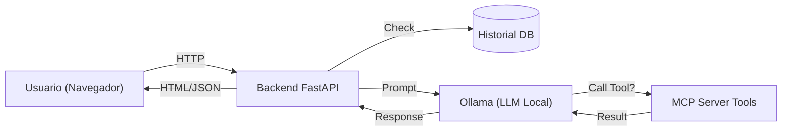

# 🧠 MCP Ollama Local

> **Web Local (FastAPI) + IA Local (Ollama) + Herramientas MCP**


---

**mcp-ollama-local** es una plataforma ligera diseñada para ejecutar un entorno de chat con IA completamente local, integrando la potencia de **Ollama** con la flexibilidad del **Model Context Protocol (MCP)**.  

Permite conversar con LLMs locales (como `qwen`, `llama3`, etc.) y otorgarles capacidades reales mediante herramientas seguras (acceso a archivos, búsqueda, información del sistema), todo con persistencia en SQLite.

> 🎓 **¿Nuevo en IA o Docker?** Consulta nuestro [Manual para Principiantes (USER_MANUAL.md)](USER_MANUAL.md) para entender conceptos básicos y por qué esto es útil para ti.

---

## 🚀 Características Principales

- **Chat Conversacional**: Interfaz web limpia para interactuar con tus modelos locales.
- **Protocolo MCP**: Integración nativa para expandir las capacidades del modelo (extensible).
- **Herramientas Seguras**: Incluye herramientas de sistema (`system_info`, `list_files`, `grep_text`).
- **Historial Persistente**: Guardado de conversaciones en SQLite.
- **Privacidad Total**: Todo corre en tu máquina (`localhost`), ideal para datos sensibles.
- **Cloud Native**: Listo para Docker y Kubernetes (K8s) desde el primer día.

## 🛠 Arquitectura

El flujo de información es directo y local:


```mermaid
graph LR
    User["Usuario (Navegador)"] -->|HTTP| FastAPI["Backend FastAPI"]
    FastAPI -->|Check| SQLite[("Historial DB")]
    FastAPI -->|Prompt| Ollama["Ollama (LLM Local)"]
    Ollama -->|Call Tool?| MCP["MCP Server Tools"]
    MCP -->|Result| Ollama
    Ollama -->|Response| FastAPI
    FastAPI -->|HTML/JSON| User
```

## 💻 Especificaciones del Sistema

Para garantizar un rendimiento fluido, especialmente al ejecutar modelos locales de IA, se recomiendan las siguientes especificaciones:

### Hardware Recomendado
- **Procesador**: Apple Silicon (M1/M2/M3) o CPU robusta con soporte AVX2.
- **RAM**:
  - Mínimo: **8 GB** (para modelos cuantizados de 7B parámetros o menores).
  - Recomendado: **16 GB** o más (para modelos de 7B+ con mayor contexto).
- **Almacenamiento**: ~10 GB libres para modelos y dependencias.

### Requisitos de Software
- **Sistema Operativo**: macOS (optimizado), Linux, o Windows (vía WSL2).
- **Python**: Versión **3.13** o superior.
- **Ollama**: Última versión estable para la ejecución del modelo.
- **Git**: Para clonar el repositorio.

## 📋 Pre-requisitos de Instalación

1.  **Ollama**: Instalado y ejecutándose en segundo plano (`ollama serve`).
2.  **UV**: Gestor de paquetes de Python de alto rendimiento (altamente recomendado) o `pip` estándar.
3.  **Modelo**: Al menos un modelo descargado (ej. `ollama pull qwen2.5-coder:7b`).

## 🚀 Modos de Despliegue

Este proyecto es extremadamente flexible y puede desplegarse donde lo necesites. Para instrucciones detalladas, consulta [📘 GUÍA DE INSTALACIÓN (INSTALL.md)](INSTALL.md).

| Entorno | Ideal para... | Comando Rápido |
| :--- | :--- | :--- |
| **💻 Local** | Desarrollo, pruebas rápidas | `make run` |
| **🐳 Docker** | Uso aislado, producción simple | `docker compose up -d` |
| **☸️ Kubernetes** | Escalado, clústeres domésticos/prod | `kubectl apply -f k8s/` |

## ⚡️ Inicio Rápido (Local)

Este proyecto incluye un `Makefile` para facilitar todas las tareas locales.

1.  **Clonar y configurar entorno**:
    ```bash
    git clone https://github.com/vladimiracunadev-create/mcp-ollama-local.git
    cd mcp-ollama-local
    make install
    ```

2.  **Asegurar que Ollama corre**:
    ```bash
    ollama serve
    # En otra terminal, descarga un modelo si no tienes uno
    ollama pull qwen2.5-coder:7b
    ```

3.  **Ejecutar la aplicación**:
    ```bash
    make run
    # O alternativamente: python main.py
    ```

4.  **Abrir en navegador**:
    Visita [http://localhost:8000](http://localhost:8000)

## 🧰 Comandos Disponibles

Usa `make help` para ver la lista completa. Los más comunes son:

| Comando | Descripción |
| :--- | :--- |
| `make install` | Instala dependencias y configura el entorno virtual. |
| `make run` | Levanta el servidor de desarrollo en puerto 8000. |
| `make lint` | Verifica estilo y errores con **Ruff**. |
| `make format` | Corrige formato de código automáticamente. |
| `make test` | Ejecuta las pruebas unitarias con **Pytest**. |
| `make clean` | Elimina archivos temporales y cachés. |

## 📂 Estructura del Proyecto

```text
mcp-ollama-local/
├── .github/            # Workflows de CI (GitHub Actions)
├── apps/
│   └── web/            # Aplicación FastAPI y frontend (+ templates/static)
├── data/               # Base de datos SQLite y logs (persistente)
├── host/               # Lógica de interacción y configuración
├── k8s/                # Manifiestos de Kubernetes
├── mcp_server/         # Servidor MCP y herramientas
├── tests/              # Suite de pruebas automatizadas
├── CHANGELOG.md        # Historial de versiones y cambios
├── Dockerfile          # Definición de imagen de producción
├── INSTALL.md          # Guía de instalación detallada
├── Makefile            # Automatización de tareas (run, test, lint)
├── docker-compose.yml  # Entorno local con Docker
├── main.py             # Punto de entrada alternativo
└── pyproject.toml      # Dependencias y configuración (Ruff/Pytest)
```

## 🤝 Comunidad
Este proyecto se rige por un [Código de Conducta](CODE_OF_CONDUCT.md). Al participar, se espera que mantengas este código.

- **Historial de Cambios**: Consulta el [CHANGELOG.md](CHANGELOG.md) para ver la evolución del proyecto.
- **Créditos**: Conoce a los creadores en [AUTHORS.md](AUTHORS.md).
- **Contribuciones**: Lee [CONTRIBUTING.md](CONTRIBUTING.md) antes de enviar tu primer PR.
- **Problemas Comunes**: Si encuentras errores, revisa [TROUBLESHOOTING.md](TROUBLESHOOTING.md) primero.

## 📚 Documentación del Proyecto

Como parte de los estándares de este ecosistema, la documentación detallada se divide en:

### 📖 Guías para Usuarios
- [📘 Guía de Instalación y Despliegue (INSTALL.md)](INSTALL.md)
- [🎓 Manual de Principiantes (USER_MANUAL.md)](USER_MANUAL.md)
- [🔄 Guía de Activación de Modelos (COMO_ACTIVAR_MODELOS.md)](COMO_ACTIVAR_MODELOS.md)
- [❓ Problemas Comunes (TROUBLESHOOTING.md)](TROUBLESHOOTING.md)

### 🏗️ Arquitectura y Evaluadores (Reclutadores/Tech Leads)
- [🕴️ Logros de Ingeniería y Reclutadores (RECRUITER.md)](RECRUITER.md)
- [🗺️ Arquitectura de Archivos (FILE_ARCHITECTURE.md)](FILE_ARCHITECTURE.md)
- [📊 Especificaciones de Sistema y Hardware (SYSTEM_SPECS.md)](SYSTEM_SPECS.md)
- [📖 Glosario Técnico del Proyecto (GLOSSARY.md)](GLOSSARY.md)
- [⚔️ Prácticas Prohibidas y Antipatrones (killed.md)](killed.md)

### ⚙️ Estandarización de Desarrollo (Comunidad)
- [⚙️ Configuración del Entorno Dev (ENVIRONMENT_SETUP.md)](ENVIRONMENT_SETUP.md)
- [📜 Historial de Cambios (CHANGELOG.md)](CHANGELOG.md)
- [🤝 Guía de Contribución (CONTRIBUTING.md)](CONTRIBUTING.md)
- [🛡️ Política de Seguridad (SECURITY.md)](SECURITY.md)
- [⚖️ Código de Conducta (CODE_OF_CONDUCT.md)](CODE_OF_CONDUCT.md)
- [🗺️ Hoja de Ruta (ROADMAP.md)](ROADMAP.md)

## 📄 Licencia

Este proyecto está bajo la Licencia MIT. Consulta el archivo [LICENSE](LICENSE) para más información.
