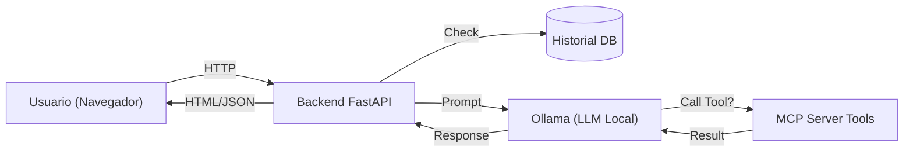

# 🧠 MCP Ollama Local

> **Web Local (FastAPI) + IA Local (Ollama) + Herramientas MCP**

---

**mcp-ollama-local** es una plataforma ligera diseñada para ejecutar un entorno de chat con IA completamente local, integrando la potencia de **Ollama** con la flexibilidad del **Model Context Protocol (MCP)**.  

Permite conversar con LLMs locales (como `qwen`, `llama3`, etc.) y otorgarles capacidades reales mediante herramientas seguras (acceso a archivos, búsqueda, información del sistema), todo con persistencia en SQLite.

> [!TIP]
> 🎓 **¿Nuevo en IA o Docker?** Consulta nuestro [Manual para Principiantes (USER_MANUAL.md)](USER_MANUAL.md) para entender conceptos básicos y por qué esto es útil para ti.

---

## 🚀 Características Principales

- **🗣️ Chat Conversacional**: Interfaz web limpia para interactuar con tus modelos locales.
- **🔌 Protocolo MCP**: Integración nativa para expandir las capacidades del modelo.
- **🛠️ Herramientas Seguras**: Incluye herramientas de sistema (`system_info`, `list_files`, `grep_text`).
- **💾 Historial Persistente**: Guardado de conversaciones en SQLite.
- **🛡️ Seguridad en 8 Capas**: Protección integral desde el contenedor hasta la red.
- **🔒 Privacidad Total**: Todo corre en tu máquina (`localhost`), 100% privado.
- **🐳 Cloud Native**: Listo para Docker y Kubernetes (K8s).

## 🏗️ Arquitectura

El flujo de información es directo y local:

```mermaid
graph LR
    User["Usuario (Navegador)"] -->|HTTP| FastAPI["Backend FastAPI"]
    FastAPI -->|Check| SQLite[("Historial DB")]
    FastAPI -->|Prompt| Ollama["Ollama (LLM Local)"]
    Ollama -->|Call Tool?| MCP["MCP Server Tools"]
    MCP -->|Result| Ollama
    Ollama -->|Response| FastAPI
    FastAPI -->|HTML/JSON| User
```

## 📊 Requisitos del Sistema

Para garantizar un rendimiento fluido, se recomiendan las siguientes especificaciones:

*   **CPU**: Apple Silicon (M1/M2/M3) o CPU robusta con AVX2.
*   **RAM**: 8 GB (mínimo) / 16 GB (recomendado).
*   **Ollama**: Instalado y ejecutándose (`ollama serve`).
*   **Modelo**: Al menos un modelo descargado (ej. `ollama pull qwen2.5-coder:7b`).

## 📥 Modos de Despliegue

| Entorno | Comando Rápido |
| :--- | :--- |
| **💻 Local** | `make install && make run` |
| **🐳 Docker** | `docker compose up -d` |
| **☸️ Kubernetes** | `kubectl apply -f k8s/` |

> [!NOTE]
> Para instrucciones detalladas, consulta la [Guía de Instalación (INSTALL.md)](INSTALL.md).

## 🧮 Comandos del Makefile

| Comando | Descripción |
| :--- | :--- |
| `make install` | Configura entorno y dependencias. |
| `make run` | Inicia el servidor en puerto 8000. |
| `make lint` | Ejecuta auditoría de código con **Ruff/Bandit**. |
| `make test` | Ejecuta la suite de pruebas con **Pytest**. |

## 🛡️ Seguridad (Defensa en Profundidad)

Este proyecto implementa un modelo de seguridad robusto de **8 capas**:

## 📚 Documentación Completa

- [📘 Instalación (INSTALL.md)](INSTALL.md)
- [🎓 Manual de Principiantes (USER_MANUAL.md)](USER_MANUAL.md)
- [🕴� Logros de Ingeniería (RECRUITER.md)](RECRUITER.md)
- [🗺� Arquitectura de Archivos (FILE_ARCHITECTURE.md)](FILE_ARCHITECTURE.md)
- [🛡� Política de Seguridad (SECURITY.md)](SECURITY.md)
- [⚔� Prácticas Prohibidas (killed.md)](killed.md)

---
### 📄 Licencia
Este proyecto está bajo la Licencia MIT.
¸� Política de Seguridad (SECURITY.md)](SECURITY.md)
- [⚖� Código de Conducta (CODE_OF_CONDUCT.md)](CODE_OF_CONDUCT.md)
- [🗺� Hoja de Ruta (ROADMAP.md)](ROADMAP.md)

## 📄 Licencia

Este proyecto está bajo la Licencia MIT. Consulta el archivo [LICENSE](LICENSE) para más información.
