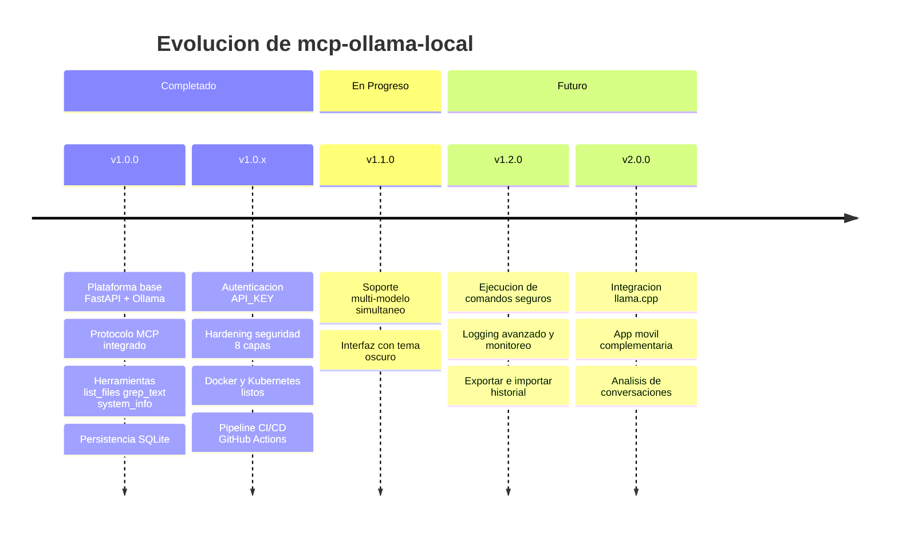

# 🗺️ Hoja de Ruta (Roadmap)

## Vision General del Proyecto

## 🚀 Versiones Futuras

### v1.1.0 (Proxima)
- [ ] Agregar soporte para múltiples modelos en Ollama simultáneamente.
- [ ] Mejorar la interfaz de usuario con temas oscuros.
- [x] Implementar autenticación básica (`API_KEY`).
- [x] Hardening de seguridad integral (8 capas).

### v1.2.0
- [ ] Soporte para ejecución de comandos seguros.
- [ ] Integrar logging avanzado y monitoreo de uso.
- [ ] Soporte para exportar/importar historial de chat.

## 🔮 Ideas a Largo Plazo
- Integración con otros proveedores de IA locales (ej. llama.cpp).
- Aplicación móvil complementaria.
- Análisis de conversaciones para insights.

---

### 📚 Documentación Relacionada
- [README.md](README.md) | [CHANGELOG.md](CHANGELOG.md) | [RECRUITER.md](RECRUITER.md)