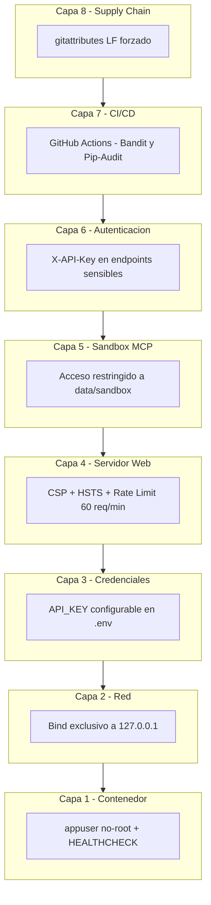

# 🛡️ Política de Seguridad y Divulgación Responsable

> [!IMPORTANT]
> La seguridad, trazabilidad y observabilidad son pilares de este ecosistema de proyectos. Tomamos con la mayor seriedad cualquier reporte referente a la integridad de nuestras aplicaciones.

## 🏗️ Versiones Soportadas

Actualmente, solo la versión `main` (última iteración o tag de release) en los distintos repositorios recibe actualizaciones y parches de seguridad directos. Las versiones antiguas legadas bajo tags sin soporte no están cubiertas a menos que se indique estrictamente lo contrario en las notas del repositorio.

## 🔓 Cómo Reportar una Vulnerabilidad

> [!CAUTION]
> **Por favor, no reportes problemas de seguridad a través de Issues públicos de GitHub.** Esto expone la vulnerabilidad a actores maliciosos antes de que el parche pueda ser emitido.

Para reportes de seguridad, fallos críticos de integridad o configuraciones por defecto mitigables (como credenciales expuestas, RCE, inyecciones de código severas, o bypass de autenticación), sigue estos pasos:

1. **Envía un correo electrónico** directamente a `vladimir.acuna.dev@gmail.com`.
2. Incluye en tu correo:
   - El ecosistema o repositorio afectado (ej. `mcp-ollama-local`).
   - Los pasos detallados para reproducir la vulnerabilidad.
   - Opcionalmente, una prueba de concepto (PoC).

Te contactaré a la brevedad posible (generalmente en menos de 48 horas laborales).

## 📊 Auditoría y Análisis Estático (SAST)

Para garantizar la integridad del código y las dependencias, el proyecto utiliza:
- **Bandit**: Analiza el código fuente en busca de patrones de programación inseguros.
- **Pip-Audit**: Escanea las dependencias instaladas contra bases de datos de vulnerabilidades (CVE).
- **Ruff**: Asegura la calidad y consistencia del código.

## 🛡️ Arquitectura de Seguridad en 8 Capas

Hemos implementado un modelo de seguridad basado en **Defense in Depth**:

1. **Contenedor**: Proceso ejecuta como usuario no-root (`appuser`), puerto no privilegiado (8000), imágenes con versiones fijas y `HEALTHCHECK` activo.
2. **Red**: Blindaje de red en `docker-compose.yml` vinculando puertos exclusivamente a `127.0.0.1`.
3. **Credenciales**: Soporte para `API_KEY` con opción de ser obligatorio (`REQUIRE_API_KEY=true`).
4. **Servidor Web**: Cabeceras de seguridad activas (`CSP`, `HSTS`, `X-Frame-Options`, `Referrer-Policy`, `Permissions-Policy`) y Rate Limiting básico (60 req/min).
5. **Herramientas MCP**: Aislamiento total en sandbox (`data/sandbox`) con validación de rutas y enmascaramiento de rutas del sistema host.
6. **Autenticación**: Capa de validación por cabecera `X-API-Key` en todos los endpoints sensibles.
7. **CI/CD**: Pipeline automatizado en GitHub Actions para detectar vulnerabilidades en dependencias y fallos de linting.
8. **Supply Chain**: Consistencia de line endings (`LF`) forzada vía `.gitattributes` para evitar errores de ejecución en Docker.

### Modelo Visual - Defense in Depth

> [!NOTE]
> Cada capa actua de forma independiente. Si una falla, las demas siguen protegiendo el sistema.

---

### 📚 Documentación Relacionada
- [README.md](README.md) | [RECRUITER.md](RECRUITER.md) | [SYSTEM_SPECS.md](SYSTEM_SPECS.md)
