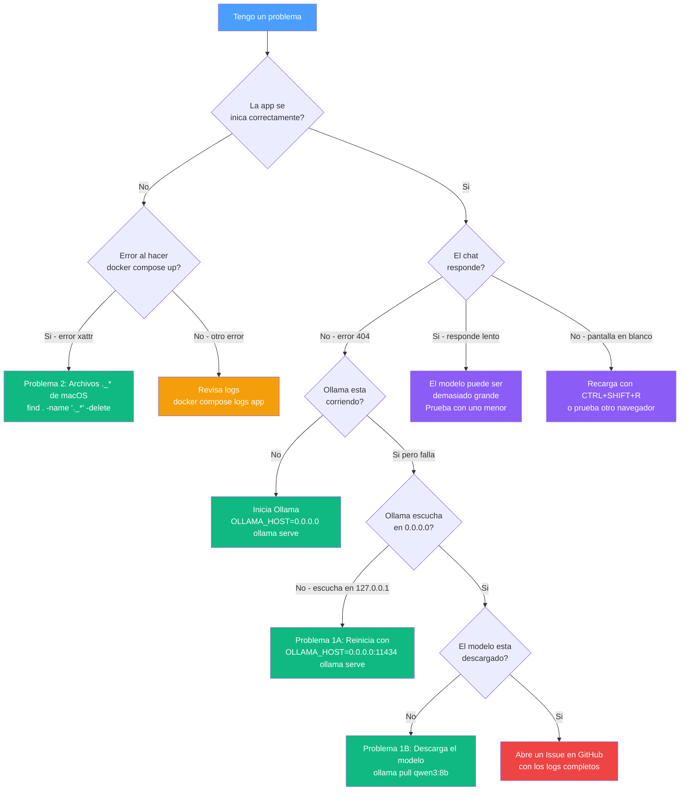

# 🔧 Guía de Resolución de Problemas (Troubleshooting)

> [!NOTE]
> Esta guía documenta problemas comunes y sus soluciones basadas en casos reales de despliegue.

## Arbol de Diagnostico Rapido

Usa este diagrama para identificar tu problema antes de leer los pasos detallados:



---

## Problema 1: Error 404 al conectar con Ollama desde Docker

### Síntomas
```
ERROR: Client error '404 Not Found' for url 'http://host.docker.internal:11434/api/chat'
```

### Causas Posibles

#### A) Ollama escuchando solo en localhost
**Diagnóstico**:
```bash
lsof -nP -iTCP:11434 | grep LISTEN
# Si ves: TCP 127.0.0.1:11434 (LISTEN) ← PROBLEMA
```

**Solución**:
```bash
pkill ollama
OLLAMA_HOST=0.0.0.0:11434 ollama serve &
```

**Verificación**:
```bash
lsof -nP -iTCP:11434 | grep LISTEN
# Debes ver: TCP *:11434 (LISTEN) ← CORRECTO
```

#### B) Modelo LLM no descargado
**Diagnóstico**:
```bash
ollama list
# Verifica que el modelo configurado esté en la lista
```

**Solución**:
```bash
ollama pull qwen3:8b
# O el modelo que hayas configurado en settings.py
```

**Configuración**:
Asegúrate de que `docker-compose.yml` y `settings.py` usen el mismo modelo:
```yaml
# docker-compose.yml
environment:
  - MODEL=qwen3:8b
```

---

## Problema 2: Contenedor no puede construirse (xattr error)

### Síntomas
```
failed to xattr /path/to/._file: operation not permitted
```

### Causa
Archivos de metadatos de macOS (`._*`) en discos externos.

### Solución
```bash
find . -name "._*" -delete
docker compose up --build -d
```

---

## Problema 3: Ollama no responde después de reiniciar

### Causa
La variable `OLLAMA_HOST` no persiste entre reinicios.

### Solución Temporal
```bash
OLLAMA_HOST=0.0.0.0:11434 ollama serve &
```

### Solución Permanente (macOS)
Agregar a `~/.zshrc`:
```bash
export OLLAMA_HOST=0.0.0.0:11434
```

---

## Verificación General de Salud

### 1. Verificar Ollama
```bash
curl http://localhost:11434/api/tags
# Debe devolver JSON con lista de modelos
```

### 2. Verificar Docker
```bash
docker compose ps
# STATUS debe ser "Up"
```

### 3. Verificar Logs
```bash
docker compose logs --tail=20 app
# Buscar: "Uvicorn running on http://0.0.0.0:8000"
```

---

## Obtener Ayuda

Si ninguna solución funciona:
1. Revisa los logs completos: `docker compose logs app`
2. Verifica versiones: `ollama --version` y `docker --version`
3. [Abre un issue en GitHub](https://github.com/vladimiracunadev-create/mcp-ollama-local/issues) con los logs y tu configuración

---

### 📚 Documentación Relacionada
- [README.md](README.md) | [INSTALL.md](INSTALL.md) | [USER_MANUAL.md](USER_MANUAL.md)
