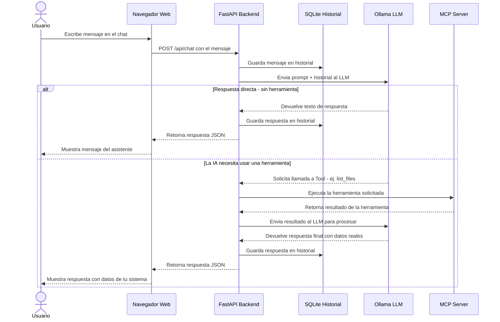

# 📘 Manual de Usuario para Principiantes

> [!NOTE]
> ¡Bienvenido! Este documento está diseñado para ayudarte a entender qué es este proyecto, por qué existe y cómo puedes sacarle provecho, incluso si no eres un experto en programación o Inteligencia Artificial.

---

## 🧐 Glosario Básico: ¿De qué estamos hablando?

Antes de empezar, aclaremos algunos términos que verás a menudo:

### 1. LLM (Large Language Model)
Es el "cerebro" de la IA. Piensa en él como una biblioteca gigante que ha leído casi todo internet y puede responder preguntas, resumir textos o escribir poesía.
*   **Ejemplos**: ChatGPT, Claude... y en este caso, **Qwen** (que corre en tu propia computadora).

### 2. Ollama
Es el programa "motor" que permite que esos cerebros (LLMs) funcionen en tu computadora personal en lugar de en la nube de una gran empresa.
*   **¿Por qué lo usamos?**: Para privacidad. Todo lo que hablas se queda en tu máquina. Nadie más lo lee.

### 3. MCP (Model Context Protocol)
Esta es la parte mágica. Normalmente, un LLM solo sabe "texto". **MCP** es como darle "manos" a la IA. Le permite usar herramientas reales.
*   **Ejemplo**: Sin MCP, la IA puede decirte cómo buscar un archivo. Con MCP, la IA puede **buscar el archivo por ti** y mostrarte el contenido.

### 4. Docker (Contenedor)
Imagina que quieres cocinar una receta compleja, pero no quieres ensuciar tu cocina ni comprar utensilios raros que solo usarás una vez. Docker te da una "cocina portátil" con todo listo.
*   **¿Qué logramos?**: Que la aplicación funcione igual en mi máquina y en la tuya, sin importar qué versión de Windows o Mac tengas.

---

## 🎯 ¿Qué hace este proyecto?

**mcp-ollama-local** combina todo lo anterior en una sola aplicación web amigable.

### ¿Para qué sirve?
Para tener un asistente inteligente (tipo Jarvis o ChatGPT) que:
1.  **Vive en tu PC**: Funciona sin internet (una vez descargado).
2.  **Es Privado**: Tus secretos empresariales o personales están seguros.
3.  **Es Útil**: Puede leer tus archivos, buscar información en tu disco duro y ayudarte a trabajar, no solo a charlar.

---

## 🔄 Flujo Completo de una Conversacion

Este diagrama muestra **exactamente** lo que ocurre cuando escribes un mensaje. Dos caminos posibles: respuesta directa o con uso de herramienta.

> [!TIP]
> El camino con **herramienta** ocurre cuando le pides a la IA que busque archivos, liste directorios o consulte info del sistema. El camino **directo** es para preguntas generales de conocimiento.

---

## 🚀 ¿Cómo se usa?

Una vez instalado (siguiendo nuestra [Guía de Instalación](INSTALL.md)), verás una pantalla de chat en tu navegador.

### Paso 1: El Chat
Escribe como si hablaras con una persona:
> "Hola, ¿puedes buscar en mis documentos qué dice el archivo de 'presupuesto.txt'?"

### Paso 2: La Magia (Herramientas)
Si la IA detecta que necesitas buscar algo, usará una "Herramienta". Verás un indicador de que está "Pensando" o "Usando herramienta".
*   **Por qué pasa esto**: La IA decide que no sabe la respuesta de memoria, así que va a "mirar" tus archivos de verdad.

### Paso 3: El Historial
Todo se guarda en una base de datos local (`SQLite`). Si cierras la ventana y vuelves mañana, la IA recordará lo que hablaron (si accedes al historial).

---

## 🔒 Seguridad y Control de Acceso

Aunque el proyecto es para uso local, hemos incluido herramientas para proteger tu información:

### 1. ¿Cómo proteger mi chat con contraseña?
Puedes usar una `API_KEY`. Para activarla:
1.  Edita tu archivo `.env`.
2.  Descomenta la línea `API_KEY=tu_secreto`.
3.  Si además defines `REQUIRE_API_KEY=true`, la web y la API requerirán esa clave para funcionar.

### 2. Control de Velocidad (Rate Limiting)
Para evitar que un proceso automático o un error sature tu computadora, el servidor permite un máximo de **60 peticiones por minuto**. Si hablas demasiado rápido, verás un mensaje de "Slow down".

### 3. El "Calabozo" (Sandbox)
La IA solo tiene permiso para ver lo que pongas dentro de la carpeta `data/sandbox`. No puede leer tus fotos personales o documentos bancarios a menos que tú los copies allí.

---

## 💡 Preguntas Frecuentes

**Q: ¿Necesito una computadora de la NASA?**
A: No, pero necesitas una decente. Se recomienda una Mac moderna (M1/M2) o una PC con buena tarjeta gráfica, porque "pensar" requiere mucha energía.

**Q: ¿Puedo romper algo?**
A: Las herramientas tienen acceso limitado (por defecto un modo seguro o de solo lectura si así se configura). Pero siempre ten cuidado al pedirle que "busque" o "lea" archivos sensibles.

**Q: ¿Por qué Docker?**
A: Para que no tengas que instalar Python, librerías, dependencias, etc. Solo instalas Docker, corres un comando y listo. Simplifica tu vida.

---

¡Esperamos que disfrutes tu propia IA personal!

---

### 📚 Documentación Relacionada
- [README.md](README.md) | [INSTALL.md](INSTALL.md) | [COMO_ACTIVAR_MODELOS.md](COMO_ACTIVAR_MODELOS.md)
