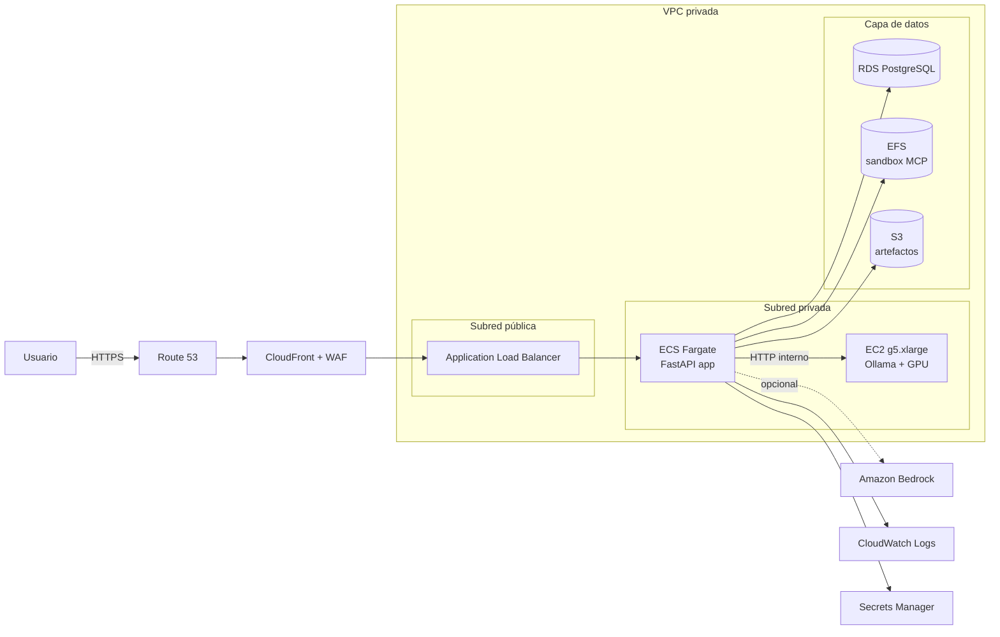
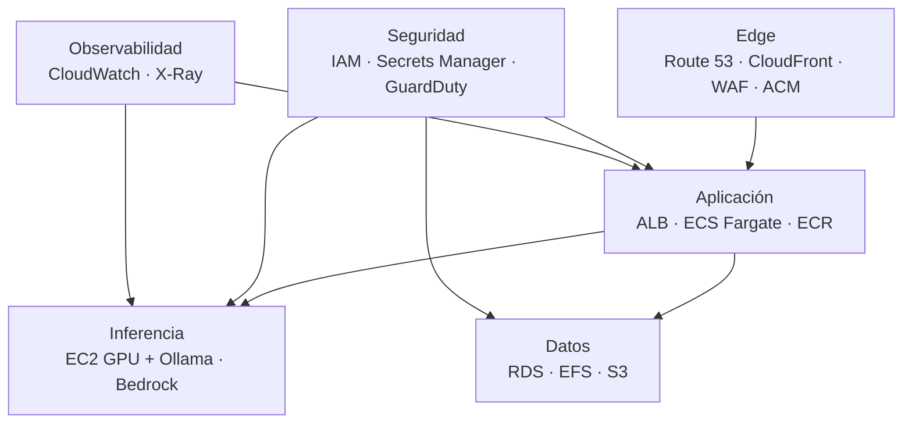
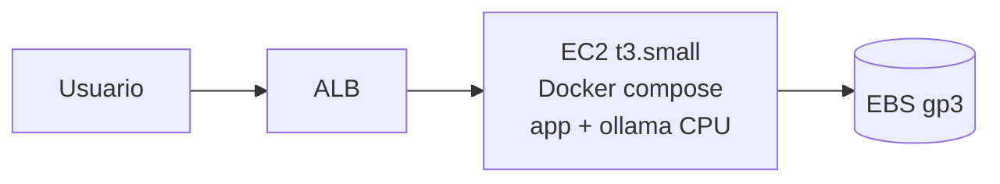
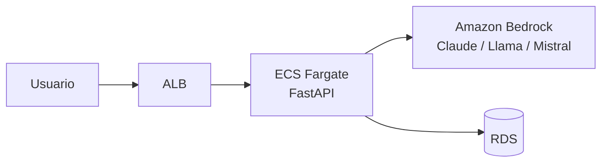
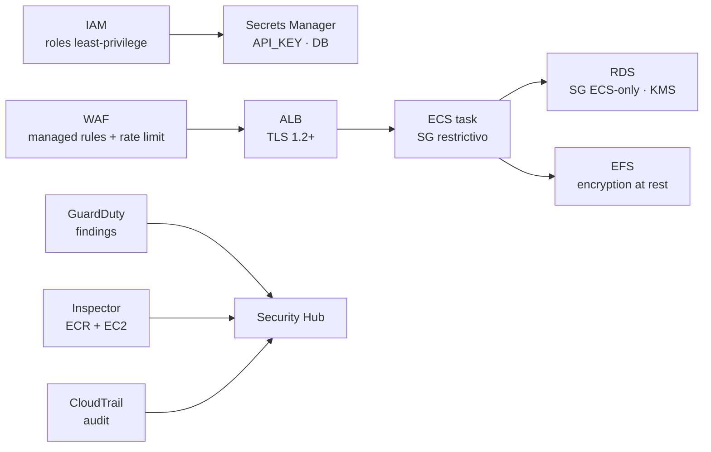
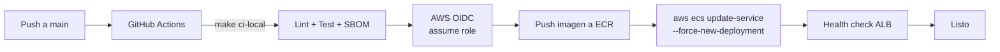

# ☁️ Migración a AWS — MCP Ollama Local

> Guía profunda y honesta para llevar este proyecto **local-first** a la nube de **Amazon Web Services**, sin perder su filosofía de simplicidad y trazabilidad.


---

## 📑 Tabla de contenidos

1. [Contexto y motivación](#-contexto-y-motivación)
2. [Lo que cambia respecto al modo local](#-lo-que-cambia-respecto-al-modo-local)
3. [Arquitectura objetivo en AWS](#-arquitectura-objetivo-en-aws)
4. [Mapeo de componentes locales → AWS](#-mapeo-de-componentes-locales--aws)
5. [Estrategias de despliegue (3 perfiles)](#-estrategias-de-despliegue-3-perfiles)
6. [Paso a paso end-to-end](#-paso-a-paso-end-to-end)
7. [Estimación de costos](#-estimación-de-costos)
8. [Seguridad en la nube](#-seguridad-en-la-nube)
9. [Observabilidad y operación](#-observabilidad-y-operación)
10. [CI/CD hacia AWS](#-cicd-hacia-aws)
11. [Riesgos, límites y decisiones abiertas](#-riesgos-límites-y-decisiones-abiertas)
12. [Checklist de migración](#-checklist-de-migración)

---

## 🎯 Contexto y motivación

`mcp-ollama-local` es por diseño una aplicación **local-first**: FastAPI + Ollama + un puente MCP acotado a un sandbox en disco. La migración a AWS **no busca** convertirlo en un SaaS multi-tenant, sino habilitar tres escenarios concretos:

- **Demo accesible**: que un evaluador o reclutador pueda probar el chat sin instalar nada.
- **Entorno compartido de equipo**: una instancia interna para validación con varios usuarios autenticados.
- **Base para evolución**: dejar la puerta abierta a usar modelos administrados (Bedrock) cuando Ollama sea insuficiente.

> [!IMPORTANT]
> Llevar Ollama a la nube **rompe** una de las garantías del proyecto: la inferencia deja de ser estrictamente local. Toda decisión documentada aquí debe leerse con esa nota presente.

---

## 🔄 Lo que cambia respecto al modo local

| Dimensión | Local | AWS |
|---|---|---|
| Inferencia | Ollama en el host | Ollama en EC2/ECS con GPU **o** Bedrock |
| Persistencia | SQLite en disco | RDS PostgreSQL **o** EFS para SQLite compartido |
| Sandbox MCP | `./data/sandbox` local | Volumen EFS aislado por instancia |
| Red | `127.0.0.1:8000` | ALB + HTTPS + WAF + Route 53 |
| Auth | API key opcional | Cognito + API Key en API Gateway |
| Secretos | `.env` | AWS Secrets Manager / SSM Parameter Store |
| Logs | stdout | CloudWatch Logs + Container Insights |
| Costo | $0 | Variable, ver [sección de costos](#-estimación-de-costos) |

---

## 🏗️ Arquitectura objetivo en AWS

### Vista general (perfil recomendado)



### Capas y responsabilidades



---

## 🧩 Mapeo de componentes locales → AWS

| Componente local | Servicio AWS | Justificación |
|---|---|---|
| `apps/web/app.py` (FastAPI) | **ECS Fargate** + **ECR** | Sin servidores, escala horizontal, encaja con el `Dockerfile` actual. |
| `mcp_server/` (stdio MCP) | Sidecar en la misma task ECS | El bridge MCP es por proceso; debe vivir junto al backend. |
| Ollama | **EC2 `g5.xlarge`** (NVIDIA A10G) o **Bedrock** | Ollama necesita GPU para modelos útiles; Bedrock evita operar GPU. |
| SQLite (`chat_history.sqlite`) | **RDS PostgreSQL `db.t4g.micro`** | SQLite no soporta múltiples writers ni Fargate stateless. |
| `data/sandbox` | **EFS** (mount en task) | Sistema de archivos compartido entre tareas Fargate. |
| `.env` | **Secrets Manager** + **SSM Parameter Store** | Rotación, audit y separación por entorno. |
| Bind local + CORS | **ALB** + **WAF** + **ACM** | TLS, reglas L7, protección básica. |
| `make ci-local` | **GitHub Actions → OIDC → ECR/ECS** | Sin claves de larga vida en CI. |
| Logs `stdout` | **CloudWatch Logs** + **Container Insights** | Búsqueda, alertas, retención. |
| Validación supply chain | **Inspector** + **ECR scan** + SBOM en S3 | Continuidad de los controles del repo. |

---

## 🚦 Estrategias de despliegue (3 perfiles)

### Perfil A — **Demo barata** (~30–60 USD/mes)



- Una sola EC2 `t3.small` con `docker compose` y modelos pequeños CPU (`qwen3:0.5b`, `phi3:mini`).
- Sin GPU, sin RDS, sin alta disponibilidad.
- Útil para enseñar el proyecto, **no** para uso real.

### Perfil B — **Producción mínima razonable** (~250–450 USD/mes)

- ECS Fargate (2 tasks) detrás de ALB.
- EC2 `g5.xlarge` con Ollama y modelos 7–8B.
- RDS PostgreSQL `db.t4g.micro` Single-AZ.
- EFS para sandbox MCP.
- WAF básico, CloudWatch, Secrets Manager.

**Es el perfil descrito en la arquitectura general.**

### Perfil C — **Sin operar GPU** (Bedrock)



- Se reemplaza Ollama por **Bedrock** mediante un adaptador en `apps/web/`.
- Cero infra de GPU, costos por token.
- **Coste hidden**: implica un cambio real de código (cliente Bedrock con `boto3`), no es solo infra.

---

## 🪜 Paso a paso end-to-end

### 0. Prerrequisitos

- Cuenta AWS con MFA y un **rol de despliegue** (no usar root).
- AWS CLI v2 configurado: `aws configure sso` o credenciales temporales.
- Terraform ≥ 1.6 **o** AWS CDK (TypeScript/Python).
- Dominio en Route 53 (opcional pero recomendado).

### 1. Cuenta y red

```bash
# Crear VPC con subredes públicas/privadas en 2 AZ
# Recomendado vía Terraform module: terraform-aws-modules/vpc/aws
```

- 2 AZ mínimo.
- NAT Gateway (1 para abaratar, 2 para HA).
- VPC endpoints para `ecr`, `logs`, `s3`, `secretsmanager` (evitan tráfico por NAT).

### 2. Build y publicación de imagen

```bash
# Login a ECR
aws ecr get-login-password --region us-east-1 \
  | docker login --username AWS --password-stdin <ACCOUNT>.dkr.ecr.us-east-1.amazonaws.com

# Build multi-arch (Fargate soporta x86_64 y arm64)
docker build -t mcp-ollama-local:$(git rev-parse --short HEAD) .

# Tag y push
docker tag mcp-ollama-local:<sha> <ACCOUNT>.dkr.ecr.us-east-1.amazonaws.com/mcp-ollama-local:<sha>
docker push <ACCOUNT>.dkr.ecr.us-east-1.amazonaws.com/mcp-ollama-local:<sha>
```

ECR debe tener `scanOnPush=true`.

### 3. Capa de datos

- **RDS PostgreSQL** `db.t4g.micro`, 20 GB gp3, Single-AZ en dev / Multi-AZ en prod.
- **EFS** con mount target en cada AZ privada.
- **S3** con versionado y `BlockPublicAccess` para artefactos / SBOM / backups.

> [!NOTE]
> El código actual usa SQLite. Migrar a Postgres requiere cambiar el driver de persistencia en `apps/web/`. Es un trabajo concreto, no una bandera de configuración.

### 4. Inferencia

**Opción Ollama en EC2:**

```bash
# AMI: Deep Learning AMI Ubuntu 22.04
# Instancia: g5.xlarge (1x A10G, 24 GB VRAM)
# User data:
curl -fsSL https://ollama.com/install.sh | sh
systemctl enable --now ollama
ollama pull qwen3:8b
```

- Security Group: solo permite 11434 desde el SG de ECS.
- Persistir modelos en un EBS gp3 dedicado (los modelos pesan).

**Opción Bedrock:** habilitar acceso a modelos en consola y crear un IAM role con `bedrock:InvokeModel`.

### 5. ECS Fargate

- Cluster `mcp-ollama-cluster`.
- Task definition con:
  - Contenedor `app` (este repo).
  - Variables de entorno: `OLLAMA_URL=http://<ip-ec2>:11434`, `DATABASE_URL=...`, `DATA_DIR=/mnt/sandbox`.
  - Secretos vía Secrets Manager (`API_KEY`, `DATABASE_URL`).
  - Volumen EFS montado en `/mnt/sandbox`.
  - Log driver `awslogs`.
- Service con 2 tasks, behind ALB target group `/api/health`.

### 6. Edge

- **ACM** certificado en `us-east-1` (para CloudFront) y región del ALB.
- **ALB** HTTPS 443, redirect 80→443.
- **CloudFront** (opcional) para cachear estáticos y reducir latencia.
- **WAF** managed rules: `CommonRuleSet`, `KnownBadInputs`, rate limit por IP.
- **Route 53** registro A alias al ALB o CloudFront.

### 7. Smoke test en la nube

```bash
curl -sS https://mcp.tu-dominio.com/api/health
curl -sS -X POST https://mcp.tu-dominio.com/api/chat \
  -H 'Content-Type: application/json' \
  -H 'X-API-Key: <secret>' \
  -d '{"message":"hola"}'
```

---

## 💵 Estimación de costos

> Cifras orientativas en **USD/mes**, región `us-east-1`, 730 h. Pueden variar; verificar siempre con [AWS Pricing Calculator](https://calculator.aws/).

### Perfil A — Demo barata

| Servicio | Spec | Coste aprox. |
|---|---|---|
| EC2 `t3.small` | On-demand 730 h | ~15 |
| EBS gp3 30 GB | | ~3 |
| ALB | 1 LCU promedio | ~18 |
| Route 53 | 1 hosted zone | ~0.5 |
| Data transfer | < 50 GB | ~5 |
| CloudWatch | logs básicos | ~3 |
| **Total** | | **~45** |

### Perfil B — Producción mínima

| Servicio | Spec | Coste aprox. |
|---|---|---|
| ECS Fargate | 2 tasks · 0.5 vCPU · 1 GB · 730 h | ~30 |
| EC2 `g5.xlarge` | On-demand 730 h | ~730 |
| EC2 `g5.xlarge` Savings Plan 1y | Compromiso | ~450 |
| EBS gp3 100 GB (modelos) | | ~10 |
| RDS `db.t4g.micro` | Single-AZ 20 GB | ~15 |
| EFS | 5 GB Standard | ~2 |
| ALB | 2 LCU promedio | ~25 |
| NAT Gateway | 1 NAT, 100 GB | ~40 |
| CloudWatch + WAF | logs + reglas managed | ~20 |
| Secrets Manager | 5 secretos | ~2 |
| Route 53 + ACM | | ~1 |
| **Total on-demand** | | **~875** |
| **Total con Savings Plan 1y** | | **~595** |

> [!WARNING]
> La GPU domina el coste. Si la utilización de la GPU < 30 %, **Bedrock suele salir más barato**.

### Perfil C — Bedrock (sin GPU)

| Servicio | Spec | Coste aprox. |
|---|---|---|
| ECS Fargate | 2 tasks pequeñas | ~30 |
| RDS `db.t4g.micro` | | ~15 |
| ALB + NAT + Route 53 | | ~65 |
| Bedrock — Claude Haiku | ~5M tokens in / 2M out al mes | ~10 |
| Bedrock — Claude Sonnet | mismo volumen | ~75 |
| Observabilidad | | ~15 |
| **Total con Haiku** | | **~135** |
| **Total con Sonnet** | | **~200** |

### Palancas de ahorro

- **Savings Plans / Reserved Instances** para EC2 GPU (hasta 40 %).
- **Fargate Spot** para tasks no críticas (hasta 70 %).
- **Apagado nocturno** del entorno de demo con EventBridge + Lambda.
- **VPC endpoints** para evitar tráfico por NAT.
- **CloudWatch retención** corta en dev (7 días).

---

## 🔐 Seguridad en la nube



Controles mínimos:

- **IAM**: roles separados para CI, ECS task, EC2 Ollama. Sin claves de usuario.
- **OIDC** entre GitHub Actions y AWS — no almacenar `AWS_ACCESS_KEY_ID` en secrets.
- **KMS** customer-managed keys para RDS, EFS, S3 con secretos.
- **VPC**: app y datos en subredes privadas, solo ALB en subred pública.
- **Security Groups** estrictos: ALB→ECS:8000, ECS→Ollama:11434, ECS→RDS:5432.
- **WAF**: Core Rule Set + rate limit (sustituye al rate-limit en memoria del repo).
- **Secrets Manager** con rotación automática para credenciales RDS.
- **GuardDuty + Security Hub + Inspector** para detección continua.
- **CloudTrail** organizacional, logs a S3 con object lock.

> [!IMPORTANT]
> El `REQUIRE_API_KEY` del repo **debe quedar en `true`** en la nube. La API key vive en Secrets Manager, no en variables de entorno literales.

---

## 📈 Observabilidad y operación

| Señal | Servicio | Qué mirar |
|---|---|---|
| Logs aplicación | CloudWatch Logs | Errores en `/api/chat`, timeouts a Ollama |
| Métricas contenedor | Container Insights | CPU/RAM, restarts |
| Métricas GPU | CloudWatch Agent + NVIDIA SMI | utilización, VRAM |
| Trazas | X-Ray | latencia ALB → ECS → Ollama |
| Alarmas | CloudWatch Alarms | 5xx > 1 %, latencia p95, GPU saturada |
| Dashboards | CloudWatch Dashboards | resumen por entorno |

Runbooks mínimos sugeridos:

- *Ollama no responde* → reiniciar servicio en EC2, fallback a Bedrock si está habilitado.
- *RDS al 80 % de conexiones* → revisar pool de SQLAlchemy.
- *5xx > umbral* → drenar la task, recrear, revisar logs.

---

## 🤖 CI/CD hacia AWS



- Reutilizar `ci.yml`, `security.yml`, `supply-chain.yml` del repo.
- Añadir `deploy-aws.yml`:
  1. `make ci-local`
  2. Build + push a ECR con tag `:sha`.
  3. `aws ecs update-service` con la nueva task definition.
  4. Esperar `services-stable`.
  5. Subir SBOM CycloneDX a S3 con tag `:sha`.

Sin claves AWS de larga vida en GitHub: usar **OIDC** y un rol con permisos mínimos.

---

## ⚠️ Riesgos, límites y decisiones abiertas

- **Trade-off de filosofía**: ya no es local-first. Documentarlo de forma visible en cualquier despliegue público.
- **GPU costosa**: una `g5.xlarge` permanente puede ser desproporcionada para uso intermitente. Considerar Bedrock o auto-stop nocturno.
- **SQLite → Postgres** requiere refactor real, no flag.
- **Sandbox MCP en EFS**: hay que revisar permisos POSIX y latencia; EFS no es disco local.
- **Rate-limit en memoria** del repo no sirve detrás de un ALB con múltiples tasks. Mover a WAF o a un store compartido (ElastiCache).
- **Cumplimiento**: si entran datos personales, evaluar tratamiento (GDPR, datos sensibles) — fuera del alcance de este blueprint.
- **Vendor lock-in moderado**: usar Terraform/CDK ayuda a salir, pero Bedrock es específico de AWS.

---

## ✅ Checklist de migración

- [ ] Cuenta AWS con MFA, IAM Identity Center, sin uso de root.
- [ ] VPC, subredes y security groups definidos en IaC.
- [ ] ECR con `scanOnPush` y lifecycle policy.
- [ ] Imagen Docker construida y publicada con tag = git SHA.
- [ ] RDS Postgres provisionado, migración SQLite → Postgres validada.
- [ ] EFS montado en la task ECS, permisos del sandbox verificados.
- [ ] Ollama en EC2 GPU **o** integración Bedrock con adaptador.
- [ ] ALB + ACM + Route 53 con HTTPS funcional.
- [ ] WAF con Core Rule Set y rate limit por IP.
- [ ] Secrets Manager con `API_KEY` y `DATABASE_URL`, rotación habilitada.
- [ ] CloudWatch Logs, alarmas y dashboard básico.
- [ ] GuardDuty + Security Hub + Inspector activos.
- [ ] CI/CD con OIDC, sin claves de larga vida.
- [ ] Smoke tests `/api/health`, `/api/chat`, `/api/mcp` pasando contra el dominio público.
- [ ] Estimación de coste mensual aprobada y monitoreo con AWS Budgets.

---

## 📚 Referencias

- [AWS Well-Architected Framework](https://aws.amazon.com/architecture/well-architected/)
- [AWS Pricing Calculator](https://calculator.aws/)
- [Amazon Bedrock](https://aws.amazon.com/bedrock/)
- [ECS Fargate best practices](https://docs.aws.amazon.com/AmazonECS/latest/bestpracticesguide/fargate.html)
- [Documento principal del proyecto](../README.md)
- [Perfil de seguridad y trust](./security-trust-profile.md)
